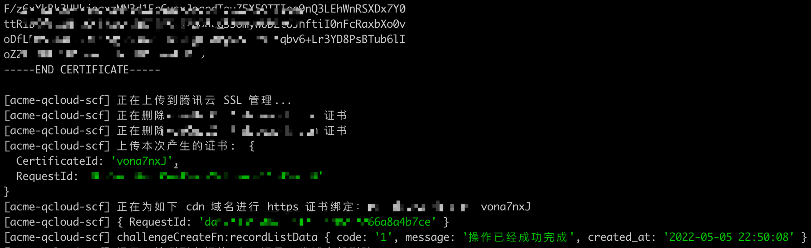

# acme-qcloud-scf

基于腾讯云·云函数的 ACME SSL 证书自动更新（Node.js 版本）。

## 功能概览

- 通过 ACME 协议 从 letsencrypt 生成免费的通配符证书。

- 部署在腾讯云·云函数（Serverless Cloud Function，SCF），定时运行更新证书。

- 证书生成后自动上传到腾讯云 SSL 托管平台并绑定到相关 CDN 加速域名。

- 服务端亦可一键更新 SSL 证书文件并生效。

> 📢 注：自动化颁发证书需要域名托管到 腾讯云 或 DNSPod 上以通过 SDK 方式进行 ACME 的 DNS 验证。

## 部署指引

### 新建云函数

在[腾讯云云函数管理后台](https://console.cloud.tencent.com/scf/list) 新建一个空白云函数。

根据个人需要命名，函数类型为**事件函数**，地域建议选择**海外**，运行环境为`Node.js 14+`。其余默认即可。

### 修改代码

`git clone` or 下载本项目代码，`npm i` 安装相关依赖。复制`config.example.js` 并重命名为 `config.custom.js`，根据实际情况改写相关配置项。

改写完毕后建议本地自测 `npm run start`，正常无误后上传到云函数中。

### 触发器

在腾讯云管理后台，点击云函数配置详情 - 触发管理，新建一个定时触发器。写法参考：

## 相关配置项说明

1. 腾讯云 secretId, secretKey 在[腾讯云控制台-访问管理-访问密钥](https://console.cloud.tencent.com/cam/capi) 进行获取或设置。建议通过子账号的形式进行云 API 调用权限授权。

2. 加速域名配置为[腾讯云控制台-内容分发网络](https://console.cloud.tencent.com/cdn/domains)

> 📢 注：`config.custom.js` 里面的字段都可以通过云函数的环境变量形式进行覆盖更新，即同一配置项两边共存情况下环境变量优先。

## 服务端证书更新指引

同样上传一份项目文件到服务端合适位置，参考`download-cert.js`文件并对相关路径进行改写。建议绑定到 `crontab` 定时执行。

> 📢 注：服务端需要支持 Node.js 环境。

